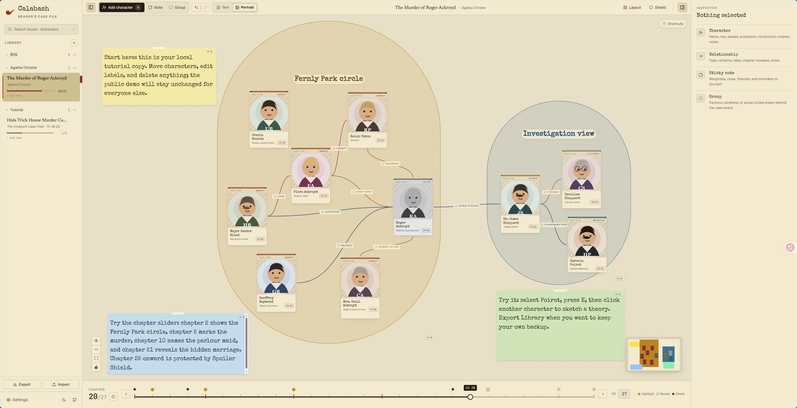

# Calabash

<p align="center">
  
</p>

> Un tablero de casos, grafo de relaciones y rastreador de pistas sin spoilers para lectores de misterio.

[Demo en vivo](https://guesswhat-studio.github.io/Calabash/) · [Reportar un problema](https://github.com/Guesswhat-Studio/Calabash/issues/new/choose) · Versión `0.5.1`

Idiomas: [English](README.md) · [简体中文](README.zh-CN.md) · [日本語](README.ja.md) · **Español** · [Português (Brasil)](README.pt-BR.md)



## Qué Es

Calabash es un tablero local-first para registrar personajes, alias, pistas, relaciones y teorías mientras lees. Su nombre viene de la pipa calabash asociada con Sherlock Holmes: la herramienta no resuelve el caso por ti, pero te acompaña mientras piensas.

Puedes usarlo como app de notas para misterio, grafo de relaciones de personajes, rastreador de pistas o tablero privado para novelas largas, casos de manga, misterios fair-play y concursos de puzzles.

La demo pública actual funciona completamente en el navegador. No hay cuentas, base de datos de lectores alojada ni guardado en servidor.

## Sin IA, Por Diseño

Las novelas detectivescas no son problemas para delegar. Son problemas para habitar.

Calabash es deliberadamente manual. No extrae personajes automáticamente, no resume la trama y no clasifica sospechosos por ti. Cada personaje que añades es alguien que decidiste observar; cada relación que dibujas es una hipótesis; cada cambio de sospechada a confirmada es una pequeña victoria de atención.

## Funciones Principales

- **Control de capítulos**: avanza por el libro y ve solo lo que sabías en ese capítulo.
- **Escudo anti-spoilers**: cubre capítulos con revelaciones hasta que decidas descubrirlos.
- **Mapa de personajes**: registra retratos, alias, roles, ocupaciones, apariciones y notas.
- **Dos estilos de tarjetas**: cambia entre tarjetas compactas de texto y tarjetas grandes con retrato.
- **Certeza de relaciones**: marca conexiones como confirmadas, sospechadas o descartadas.
- **Campos abiertos**: los roles y tipos de relación son sugerencias, no límites.
- **Notas y grupos**: guarda pistas cerca del tablero y dibuja regiones de grupo detrás de los personajes.
- **Ilustraciones**: fija planos, capturas y otras referencias visuales encima o debajo del tablero.
- **Importaciones iniciales**: empieza un libro desde un JSON de libro, con una plantilla amigable para LLM.
- **Biblioteca local**: guarda libros en IndexedDB y respáldalos con Exportar/Importar.
- **Tutoriales incluidos**: prueba *The Murder of Roger Ackroyd* o *Hida Trick House Murder Case*.
- **Interfaz multilingüe**: inglés, chino simplificado, japonés, español y portugués de Brasil.
- **Plantilla de acertijo, iPad y CNB**: `v0.5.1` añade una plantilla inicial para concursos de misterio, mantiene el control de capítulos fuera del área segura de iPad Safari e incluye la ruta de release en CNB.

## Datos Y Privacidad

Calabash es local-first:

- Tus libros se guardan en tu navegador con IndexedDB.
- Tema, idioma y guía inicial usan localStorage.
- Otros visitantes de la demo no pueden cambiar tu tablero, y tú no puedes cambiar el suyo.
- Durante la beta, borrar los datos del sitio en el navegador puede eliminar tu biblioteca local.
- Usa **Export Library** como copia de seguridad e **Import Library** para mover tus datos.
- En escritorio, las importaciones de biblioteca completa crean primero una copia de seguridad local en la carpeta de datos de la app.

## Inicio Rápido

1. Abre la [demo en vivo](https://guesswhat-studio.github.io/Calabash/).
2. Elige el tutorial de Ackroyd, el tutorial de Kindaichi o un libro en blanco.
3. Pulsa `N` para añadir un personaje.
4. Selecciona un personaje, pulsa `E` y haz clic en otro para crear una relación.
5. Mueve el control de capítulos mientras lees.
6. Exporta tu biblioteca cuando quieras una copia de seguridad.

## Para Quién Es

Calabash es para lectores que disfrutan hacer el trabajo detectivesco:

- Lectores de misterio clásico: Agatha Christie, Ellery Queen, John Dickson Carr, S. S. Van Dine.
- Fans de manga y series de misterio con alias, identidades ocultas y revelaciones tardías.
- Solucionadores de puzzles y concursos de misterio que necesitan un tablero temporal para personas, pistas, lugares e hipótesis.
- Lectores de ficción con muchos personajes: fantasía, novela histórica, sagas familiares, thrillers políticos.
- Cualquiera que quiera una herramienta privada, tranquila y sin cuenta para pensar con una historia.

Calabash no es un tracker de libros, lector de ebooks, herramienta de escritura, resumidor de IA ni plataforma social.

## Desarrollo

La app vive en `app/` y usa Vite + React.

```bash
cd app
npm install
npm run dev
npm run typecheck
npm test
npm run build
```

Shell de escritorio:

```bash
npm install
npm run desktop:dev
npm run desktop:build
```

Los builds de escritorio requieren Rust y usan el shell Tauri 2 en `src-tauri/`. La app React sigue siendo el unico frontend para web y escritorio.

Builds de release:

- Cada version publica debe tener un tag anotado `vX.Y.Z` y una GitHub Release.
- Al subir un tag `v*`, se ejecuta el release workflow y se carga el web bundle.
- A partir del shell de escritorio `0.2`, el mismo workflow tambien carga binarios desktop simples y sin firma para Windows, Linux y macOS.

## Roadmap

El roadmap del producto no se mantiene dentro del repositorio público. La planificación pública debe vivir en [GitHub Projects](https://github.com/orgs/Guesswhat-Studio/projects); GitHub Issues queda para bugs, feedback beta y propuestas.

## Versión

Calabash usa versionado beta `0.x`. `0.1.3` refuerza los avisos de almacenamiento beta, la cobertura con fixture de importación/exportación y la validación de release. `0.2.0` se centra en el shell de escritorio, la configuración de binarios multiplataforma, el selector de idioma inicial, notas/grupos visibles por capítulo, arreglos de renderizado de relaciones y anotaciones ajustables del tablero. `0.2.1` agrega verificación de versiones en Settings e importación de JSON de un solo libro para iniciar casos más rápido. `0.2.2` agrega interfaz japonesa, README/SEO en japonés y tutoriales localizados, especialmente el caso de Kindaichi. `0.3.0` agrega ilustraciones por capítulo, pegado desde portapapeles, capas de fondo y el rediseño de Settings como carpeta de caso. `0.3.1` corrige la barra superior compacta para mantener visibles el título y el botón del inspector. `0.4.0` es una pasada de estabilidad de escritorio con diálogos nativos de archivo, copias de seguridad antes de importar bibliotecas completas y mensajes más claros de importación/exportación. `0.5.0` pule la interacción en tablets, activa un bloqueo real del tablero, distingue títulos de casos duplicados y reduce los chunks de producción. `0.5.1` añade una plantilla inicial de acertijo, corrige el área segura del control inferior en iPad Safari y cubre el despliegue de releases en CNB.

## License

MIT
