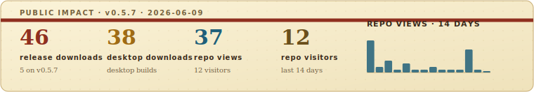
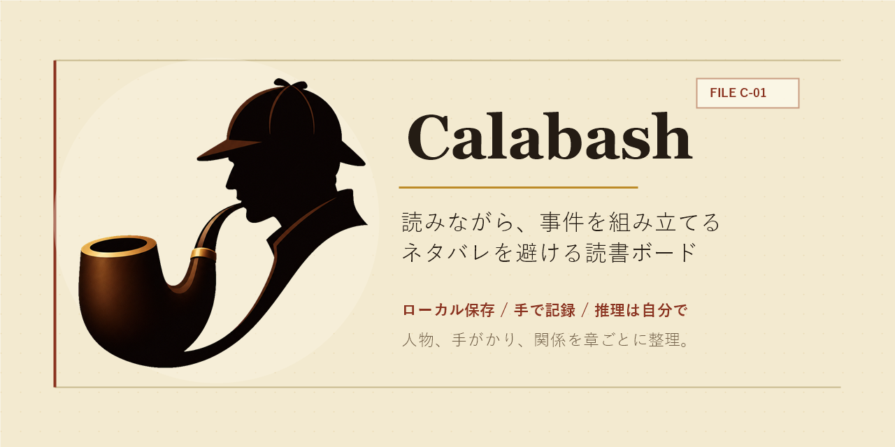

# Calabash

<p align="center">
  
</p>

> ミステリ読者のための、ネタバレ防止事件ボード・人物関係図・手がかりトラッカー。

[ライブ demo](https://guesswhat-studio.github.io/Calabash/) · [Issue を報告](https://github.com/Guesswhat-Studio/Calabash/issues/new/choose) · バージョン `0.5.4`

言語: [English](README.md) · [简体中文](README.zh-CN.md) · **日本語** · [Español](README.es.md) · [Português (Brasil)](README.pt-BR.md)

## インパクトスナップショット

<p align="center">
  
</p>

## これは何か

Calabash は、読書中に人物、別名、手がかり、関係、推理を記録するローカルファーストの事件ファイルボードです。名前は Sherlock Holmes の calabash pipe から来ています。このツールは事件を解くのではなく、あなたが考えるための余白を作ります。

推理小説メモ、探偵小説の人物関係図、手がかり整理、長編小説や漫画ケース、推理コンテスト用の一時的な事件ボードとして使えます。

現在の公開 demo は完全にブラウザ内で動きます。アカウント、クラウド保存、サーバー側の読書データベースはありません。




## AI なし

探偵小説は外注するパズルではなく、自分で入り込むためのパズルです。

Calabash はあえて手作業です。人物の自動抽出も、あらすじ生成も、犯人予想もありません。追加する人物、描く関係線、確定に変える推理は、すべて読者自身の注意から生まれます。

## 主な機能

- **章スライダー**: 読書位置に合わせて、その時点で知っている情報だけを表示します。
- **ネタバレシールド**: 重要な開示を含む章を、見ると決めるまで隠せます。
- **人物ボード**: ポートレート、別名、役割、職業、登場章、メモを追跡できます。
- **ボード表示**: コンパクトなテキストカードと大きなポートレートカードを切り替えられます。
- **関係の確度**: 関係を確認済み、疑い、否定済みにできます。
- **自由な入力欄**: 役割や関係タイプは候補であり、入力を制限しません。
- **付箋とグループ**: 手がかりをボード上に置き、人物の背面に色つきグループを描けます。
- **挿絵**: 間取り図、スクリーンショット、視覚資料をボードの上または下に固定できます。
- **ボード書き出し**: 上部ツールバーから現在のボードを透明 PNG または PDF として書き出せます。
- **スターターインポート**: 単体本 JSON と LLM 向けテンプレートから本を開始できます。
- **ローカルライブラリ**: IndexedDB に保存し、Export/Import でバックアップできます。
- **内蔵チュートリアル**: *The Murder of Roger Ackroyd* と *飛騨からくり屋敷殺人事件* を試せます。
- **多言語 UI**: 英語、簡体字中国語、日本語、スペイン語、ブラジルポルトガル語。
- **テンプレートと章の安全性**: `v0.5.2` は再利用可能な本テンプレート、現在の本のテンプレート書き出し、GitHub プレビューカード、既存の章別コンテンツより総章数を小さくできない保護を追加します。
- **タッチと小画面 fallback**: `v0.5.3` はタブレットのタッチ smoke test、コンパクトな Help、スマホ向け読み取り専用 fallback、ライブラリ/Settings の整理を追加します。
- **ボード安定性・時間レイヤー・書き出し・インパクト**: `v0.5.4` は Help をクリックで開く方式にし、Auto-layout の undo/redo、時間レイヤーと『七回死んだ男』ループ demo、タブレット向けレイヤーサムネイル、PNG/PDF ボード書き出し、スマホ Settings のレスポンシブ表示、README のインパクトスナップショットを追加します。

## データとプライバシー

Calabash はローカルファーストです。

- 本はブラウザの IndexedDB に保存されます。
- テーマ、言語、オンボーディング設定は localStorage を使います。
- 他の demo 訪問者はあなたのボードを変更できず、あなたも他の人のボードを変更しません。
- beta 期間中、ブラウザのサイトデータを消すとローカルライブラリが削除されることがあります。
- バックアップには **Export Library**、移行には **Import Library** を使ってください。
- デスクトップ版では、ライブラリ全体をインポートする前にアプリデータフォルダへ安全バックアップを作成します。

## クイックスタート

1. [ライブ demo](https://guesswhat-studio.github.io/Calabash/) を開きます。
2. Ackroyd チュートリアル、金田一チュートリアル、または空の本を選びます。
3. `N` で人物を追加します。
4. 人物を選択して `E` を押し、別の人物をクリックして関係を追加します。
5. 章スライダーを読書進度に合わせて動かします。
6. バックアップしたいときはライブラリをエクスポートします。

## 対象読者

Calabash は、自分で推理を進めるのが好きな読者向けです。

- Agatha Christie、Ellery Queen、John Dickson Carr などの古典ミステリ読者。
- 別名、仮面の正体、後半の開示を追いたい漫画・ドラマのミステリファン。
- 人物、手がかり、場所、仮説を一時的に整理したい推理パズルやコンテスト参加者。
- 人物が多い作品を読む人: ファンタジー、歴史小説、家族サーガ、政治スリラーなど。
- 静かで私的な、アカウント不要の思考ツールがほしい人。

Calabash は読書記録アプリ、電子書籍リーダー、執筆ツール、AI 要約ツール、SNS ではありません。

## コミュニティ

- 再現できるバグ、beta フィードバック、具体的な提案、docs 修正、テンプレート提供:
  [Issue chooser](https://github.com/Guesswhat-Studio/Calabash/issues/new/choose)
  を使ってください。
- 質問、セットアップ相談、初期アイデア、show-and-tell:
  [GitHub Discussions](https://github.com/Guesswhat-Studio/Calabash/discussions)
  を使ってください。
- 開発環境と PR の期待値: [CONTRIBUTING.md](CONTRIBUTING.md) を参照してください。
- セキュリティ報告: 公開 Issue ではなく [SECURITY.md](SECURITY.md)
  に従ってください。

## 開発

アプリは `app/` にあり、Vite + React で動きます。

```bash
cd app
npm install
npm run dev
npm run typecheck
npm test
npm run build
```

デスクトップ shell:

```bash
npm install
npm run desktop:dev
npm run desktop:build
```

デスクトップビルドには Rust が必要で、`src-tauri/` の Tauri 2 shell を使います。React app は web と desktop の共通フロントエンドです。

リリースビルドでは、`vX.Y.Z` tag で GitHub Release を作成し、web bundle と Windows/Linux/macOS の desktop asset をアップロードします。すべての GitHub Release asset が揃った後、workflow は最新版 asset を CNB にミラーし、GitHub は完全な履歴アーカイブとして残します。

## バージョン

Calabash は現在 `0.x` beta バージョニングです。`0.2.0` はデスクトップ shell、章ごとの付箋/グループ、関係線の修正、調整可能なボード注釈を追加しました。`0.2.1` は Settings の更新チェックと単体本 JSON インポートを追加しました。`0.2.2` は日本語 UI、日本語 README/SEO、そして特に金田一 case の日本語チュートリアル demo を追加しました。`0.3.0` は章ごとの挿絵、クリップボード貼り付け、背景レイヤー、事件フォルダ風 Settings を追加しました。`0.3.1` は狭いボードでもタイトルとインスペクター切り替えを表示する toolbar 修正です。`0.4.0` はデスクトップ安定性のため、ネイティブファイルダイアログ、ライブラリ全体インポート前の安全バックアップ、より明確なインポート/エクスポート完了表示を追加しました。`0.5.0` はタブレットでの操作性、有効なボードロック、重複 case タイトルの区別、より小さな production chunk を追加しました。`0.5.1` は iPad Safari の下部章スライダー安全領域修正と CNB release デプロイ確認を追加しました。`0.5.2` は再利用可能な本テンプレート、現在の本のテンプレート書き出し、GitHub プレビューカード、既存の章別コンテンツを守る総章数ガードを追加しました。`0.5.3` はタブレットのタッチ smoke test、実際の GitHub 更新確認 smoke、コンパクトな Help、スマホ向け読み取り専用 fallback、ライブラリ/Settings の整理を追加しました。`0.5.4` は Help をクリックで開く方式にし、Auto-layout の undo/redo、時間レイヤーと『七回死んだ男』ループ demo、タブレット向けレイヤーサムネイル、上部ツールバーの PNG/PDF ボード書き出し、スマホ Settings のレスポンシブ表示、README のインパクトスナップショットを追加しました。

## License

MIT
