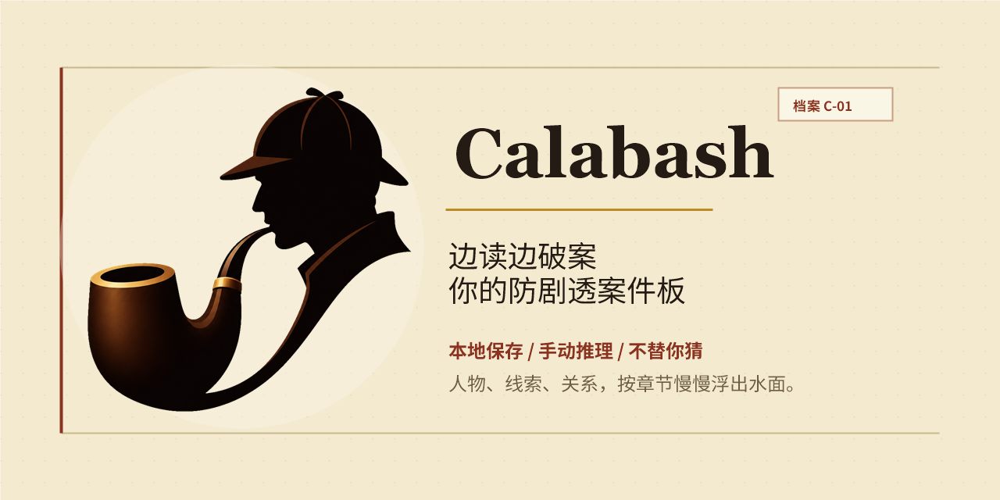

# Calabash

<p align="center">
  
</p>

> 给推理小说读者使用的防剧透案件板、人物关系图和线索整理工具。

[在线 Demo](https://guesswhat-studio.github.io/Calabash/) · [反馈问题](https://github.com/Guesswhat-Studio/Calabash/issues/new/choose) · 版本 `0.5.6`

语言：[English](README.md) · **简体中文** · [日本語](README.ja.md) · [Español](README.es.md) · [Português (Brasil)](README.pt-BR.md)

## 影响力快照

<p align="center">
  
</p>

## 它是什么

Calabash 是一个本地优先的案件资料板。你可以一边读书，一边记录人物、别名、线索、关系和自己的推理。它的名字来自 Sherlock Holmes 的葫芦形烟斗：工具不会替你破案，但会陪你一起思考。

你可以把它当作推理小说笔记、人物关系图、线索整理板，或每周谜题、推理比赛时临时使用的私人案件板。

目前公开 Demo 完全在浏览器中运行。没有账号系统，没有云端读者数据库，也没有服务器保存用户内容。




## 不做 AI，这是设计选择

侦探小说不是拿来外包的题目，而是需要亲自进入的谜题。

Calabash 是刻意手动的。它不会自动提取人物，不会总结剧情，也不会替你猜凶手。你添加一个人物，是因为你决定注意到他；你画一条关系，是因为你愿意提出一个假设；你把一条线从“怀疑中”改成“已确认”，那就是一次小小的推理胜利。

## 主要功能

- **章节滑杆**：随着阅读进度移动，只显示当时已经知道的信息。
- **防剧透保护**：关键揭示章节可以先遮住，等你决定再打开。
- **人物关系板**：记录头像、别名、角色、职业、登场章节和笔记。
- **两种卡片视图**：可以在紧凑文字卡和大图案件卡之间切换。
- **关系确定性**：关系可以标记为已确认、怀疑中或已推翻。
- **开放文本字段**：角色和关系类型有建议值，但不会限制你输入。
- **便笺与分组**：把线索放在画布旁边，也可以在人物背后画彩色分组范围。
- **插图**：可以把平面图、截图和其他视觉资料固定在白板上方或下方。
- **看板导出**：可以从顶部工具栏把当前看板导出为透明 PNG 或 PDF。
- **初始导入**：新建书籍时可以导入单本 JSON，也提供适合 LLM 生成的模板。
- **本地书库**：数据存储在 IndexedDB，通过导出/导入做备份和迁移。
- **内置教程**：可以试用《罗杰疑案》和《飞驒机关宅邸杀人事件》。
- **多语言界面**：英文、简体中文、日文、西班牙语、巴西葡萄牙语。
- **模板与章节安全**：`v0.5.2` 增加可复用书籍模板、当前书模板导出、GitHub 预览图，并阻止总章节数低于已有章节内容。
- **触控与小屏 fallback**：`v0.5.3` 补齐平板触控烟测、紧凑 Help 面板、手机只读书库 fallback，并整理书库/设置入口。
- **看板稳定性、时间层、导出与影响力快照**：`v0.5.5` 将 Help 改成点击展开，让自动布局可以撤销/重做，加入时间层、《死了七次的男人》循环教程和平板 layer 缩略入口，支持 PNG/PDF 看板导出，改善手机 Settings 自适应，并在 README 顶部加入影响力快照。
- **桌面可靠性小修**：`v0.5.6` 增加 `L` 锁定/解锁选中元素快捷键，上传头像会压缩为 JPEG，并在桌面版看板图片导出失败时写入本地诊断日志。

## 数据与隐私

Calabash 是本地优先工具：

- 你的书本保存在当前浏览器的 IndexedDB 中。
- 主题、语言、新手引导等偏好保存在 localStorage 中。
- 其他 Demo 访问者不会修改你的内容，你也不会修改他们的内容。
- beta 期间，清除浏览器站点数据可能会删除本地书库。
- 请用 **Export Library** 备份，用 **Import Library** 迁移到其他浏览器。
- 桌面版在导入完整书库前，会先在应用数据目录保存一份本地安全备份。

## 快速开始

1. 打开 [在线 Demo](https://guesswhat-studio.github.io/Calabash/)。
2. 选择罗杰疑案教程、金田一教程，或创建空白书本。
3. 按 `N` 添加人物。
4. 选中人物后按 `E`，再点击另一个人物添加关系。
5. 用章节滑杆跟随阅读进度。
6. 需要备份时导出书库。

## 适合谁

Calabash 适合喜欢自己做推理功课的读者：

- Agatha Christie、Ellery Queen、John Dickson Carr 等经典推理读者。
- 喜欢记录别名、伪装身份、后期揭示的漫画和剧集观众。
- 做每周谜题、推理比赛或长篇谜题时，需要整理人物、地点、线索和假设的解谜者。
- 阅读人物众多小说的人：奇幻、历史、家族传奇、政治惊悚等。
- 想要一个安静、私密、无需账号的阅读思考工具的人。

Calabash 不是读书记录工具、电子书阅读器、写作软件、AI 总结器或社交平台。

## 社区

- 可复现 bug、beta 反馈、明确功能提案、文档修正和模板贡献：使用 [issue 选择器](https://github.com/Guesswhat-Studio/Calabash/issues/new/choose)。
- 使用问题、环境配置帮助、早期想法和展示分享：使用 [GitHub Discussions](https://github.com/Guesswhat-Studio/Calabash/discussions)。
- 贡献环境和 PR 要求：见 [CONTRIBUTING.md](CONTRIBUTING.md)。
- 安全问题：请按 [SECURITY.md](SECURITY.md) 私下报告，不要开公开 issue。

## 开发

应用位于 `app/`，使用 Vite + React。

```bash
cd app
npm install
npm run dev
npm run typecheck
npm test
npm run build
```

桌面壳：

```bash
npm install
npm run desktop:dev
npm run desktop:build
```

桌面构建需要 Rust，并使用 `src-tauri/` 中的 Tauri 2 壳。React app 仍然是 web 和 desktop 共用的唯一前端。

发布构建：

- 每个公开版本都应该有一个 `vX.Y.Z` annotated tag 和 GitHub Release。
- 推送 `v*` tag 会运行 release workflow，并上传 web bundle。
- 从 `0.2` 桌面壳开始，同一个 workflow 也会上传 Windows、Linux 和 macOS 的未签名纯 desktop binary。
- GitHub Release 的全部附件就绪后，workflow 会把最新版附件镜像到 CNB 供国内下载；GitHub 仍保留完整历史归档。

## 路线图

产品路线图不会放在公开仓库中。公开规划建议使用 [GitHub Projects](https://github.com/orgs/Guesswhat-Studio/projects)；GitHub Issues 用于 bug、beta 反馈和功能建议。

## 版本

当前使用 `0.x` beta 版本号。`0.1.3` 补强了 beta 存储提示、导入/导出夹具回归测试和发布验证。`0.2.0` 聚焦桌面壳、全平台二进制发布配置、引导语言选择、按章节显示的便笺/分组、关系线渲染修复，以及可调整的白板标注。`0.2.1` 增加 Settings 中的版本检查，以及用于快速初始化案件的单本 JSON 导入。`0.2.2` 增加日文 UI、日文 README/SEO 信息，并本地化教程 demo，尤其是金田一案例。`0.3.0` 增加按章节显示的插图、剪贴板粘贴、背景分层，以及案卷风格 Settings 重设计。`0.3.1` 修复窄宽度白板的顶部栏，让书名和右侧检查器按钮保持可见。`0.4.0` 是桌面稳定性版本，加入系统原生文件对话框、完整书库导入前安全备份，以及更清楚的导入/导出完成提示。`0.5.0` 改善平板触控交互、有效白板锁、重复案件标题区分，以及更小的生产构建分块。`0.5.1` 修复 iPad Safari 底部章节栏安全区遮挡，并覆盖 CNB release 部署流程。`0.5.2` 增加可复用书籍模板、当前书模板导出、GitHub 预览图，以及已有章节内容的总章节数防呆保护。`0.5.3` 补齐平板触控烟测、真实 GitHub 更新检查烟测、紧凑 Help 说明、手机只读 fallback，并整理书库/设置界面。`0.5.5` 将 Help 改为点击展开，支持自动布局撤销/重做，加入时间层、《死了七次的男人》循环教程和平板 layer 缩略入口，支持顶部工具栏 PNG/PDF 看板导出，改善手机 Settings 自适应，并加入 README 影响力快照。`0.5.6` 增加选中元素锁定快捷键、头像 JPEG 压缩、桌面导出诊断日志，并刷新烟测和发布 metadata。

## License

MIT
